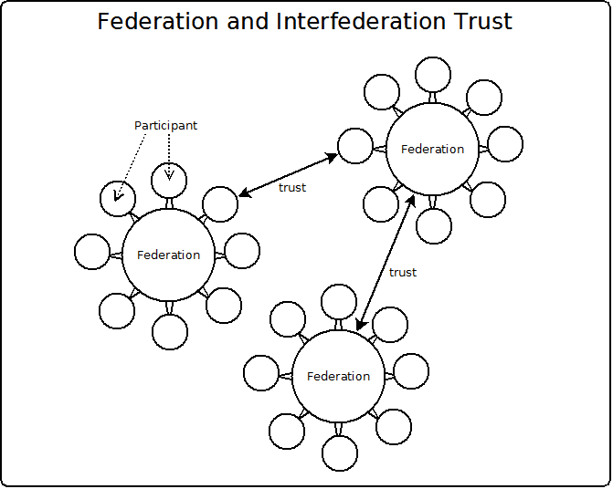

# Multiparty Federation

Federated identity protocols like SAML and OpenID Connect enable us to
authenticate people in other domains.  But trust issues quickly surface.
For example, if your organization operates a website with valuable
content, and someone you authenticated at another domain steals the
content, what recourse do you have? If your organization operates
an OpenID Provider, and a relying party website is hacked (potentially exposing
your account holder's personal information) do you expect to be notified? And
what rights do you have to update information at identity providers
or websites that you use? These related federated trust considerations are aptly
described by Scott David, a legal identity scholar, as the "triangle of trust."

Figure 10-1 conveys what type of trust is needed, and by whom. It uses
OpenID Connect vocabulary (OP, RP) but you could substitute the equivalent
SAML terms (IDP, SP). While you are most likely to hear about "Level of
Assurance" of an authentication, you are less likely to hear about the
"Level of Protection" or "Level of Control". But these trust considerations
are equally important.

Let's summarize for each vertex:

* Level of Assurance: The RP (website) needs assurance from the OP.  Is the
person who is the subject of the assertion really who they say they are? How
well did you identity proof this person? Did you check a state issued ID?
Did you verify with the issuer that the ID was valid? How well did you
authenticate the person? And how secure are your account recovery procedures?
The OP provides assurance, and is some cases liability protection, to the RP.
The assertion is only as good as the identity management and security practices
behind it.  

* Level of protection: The OP wants the website to protect the data.
Most RP's will write data to their database. Using
federated identity, RP's don't need the secret credentials (e.g. passwords),
but it is common for RP's to create a local account for each person to track
their history and preferences. Whether or not the person approved the release
of information explicitly or implicitly to the RP, most OP's expect a certain
amount of diligence with regard to the handling of shared PII. The RP should
adopt best practices for data security.

* Level of control: The person wants to update, remove or otherwise direct the
use of their data. Today people are demanding control of their data as a
human right. However, within an ecosystem, the concept of data ownership gets
murky fast, as a person can't necessarily demand the removal for their personal
information. For example, if an employee places an order, who's data is it? The
employee's? The buyer's? Or seller's?  Federation agreements can specify more
clearly what rights people have to control the use and accuracy of the data.

Our national, state, and international laws can't be relied on to
create a workable trust fabric. At best, they are a
patchwork of frequently outdated regulations, that tend to
inconsistently address issues of assurance, protection and control.
For example, in the US, the HIPPA regulations specify data must
be protected by encryption. Other government regulations are
proscriptive about assurance, but say nothing less about protection.
The EU GDPR regulations focus on giving the person more control
over their data--we don't have such protections in the U.S.

Two organizations can achieve trust by describing all the contingencies
in legal contracts. For example, the contract can specify acceptable
types of authentication, the procedure for breach notifications, and
obligations to update or remove a person's information upon their
request. However, in a large ecosystem with many companies, requiring
each pair of organizations to negotiate a bilateral agreement is not
efficient. Each organization would need n-1 agreements, where n is the
number of ecosystem participants.

A better approach is to define one standard contract that level sets
assurance, protection and control within the community. If each
federation participant signs a standard participant agreement,
one-off agreements can be greatly reduced.

Federations have existed for a long time. In government, a federation
describes multiple autonomous states ceding authority to a central entity. The
United States itself is "federal"--i.e. granted certain powers in the Constitution
by the states in the interest of efficiency. The Internet itself is a federation--
those connected agree to use IP addresses. Internet standards enable tcp,
udp, tls, http and other communication streams.

There are many existing industry federations. If you are a member
of a stock exchange, a sports league, or even a farming collective,
you decide that it's worthwhile to give up some autonomy to gain
efficiency in an ecosystem.

Information security federations define the **tools and rules** for trust.
The first identity federations improved connectivity. The EduRoam
higher education network enables reciprocal WiFi across participating
campuses. Higher education was also an early adopter of SAML federations.
In the U.S., InCommon (https://incommon.org) has approximately 1000 members:
700 universities and 300 web sites. InCommon also has an interfederation
agreement with Edugain. Government, defense, pharmaceutical
and automotive industries also have created supply chain SAML federations.

Federation "tools" are protocols, data structures and vocabularies.
Imagine how expensive it would be if every website used a different
identifier for first name and last name. InCommon specifies that
participants must support the eduPerson attributes. Beyond user claims,
identity federations could define standard vocabularies for authentication
mechanisms, OAuth scopes, and other custom schema.

Federation "rules" are the legal agreements that bind the parties
together. There are a few legal recipes for how to
accomplish this. The following recipe is for three agreements:
a "Federation Policy", which defines the top level governance; a
"Data Protection Code of Conduct", which defines not
just protection, but also privacy responsibility of
participants that hold data about people; and finally,
the "Network Use Agreement", which should be displayed
each time the person is authenticated at a participant.

Federations are not tied to specific protocols or technologies. Technical and
legal innovations are inevitable, and effective federations will evolve to
address new realities.

### Federation Policy

Does the federation have a steering committee? If so,
This document describes the governance of the federation.
how many members? Serving for how long? Voting in what
way? The Federation Policy should also define how
the federation is managed. Who will operate the day
to day services?  How should the federation  market itself
to drive more memberships? The Federation Policy covers
a few more important areas like disputes resolution, and
how an organization could become a participant. You
can find quite a few federation polices on the
Internet, as these are public documents, and most
large federation operators point you to them.

###  Data Protection Code of Conduct

With the intent of giving people more control of their data,
participants agree to a Data Protection Code of Conduct,
regarding the handling of personal information. The
federation can define the baseline expectations for consent,
notification and data protection. The document may
also detail the data retention period and the
rights of a person to access or rectify their data.

###  Network Use Agreement

Ultimately, the buck stops with people. End-users have to take
responsibility for their own security hygiene. That includes
taking the appropriate level of care to protect their credentials
from loss or compromise. The network banner, also informs the
person about their rights to correct information, to request
removal from a service, and sometimes where to direct questions at the
federation or participant.

## Federation Actors

As this is a book for geeks, not lawyers, back to the tools! Figure 10-3 shows
the actors that participate in an identity federation.

* Registration Authority: trusted third party that operates the federation
technical infrastructure. For example, a hosting company, ISP, or
telecommunications provider.

* Federation Operators: the organization that makes the rules, specifies
the tools, and vets members. The federation should also perform due diligence
on the Registration Authority, as the federation is partially liable for
its operation.  

* Participant: An organization who is qualified to join a federation, and who
signs all the necessary legal agreements, and pays all fees.

* Entity: a service operated by a participant or the federation. Generally,
the service needs to register its cryptographic signing key with the federation,
and the web endpoints where its services can be found. It may also register
other information that is useful to publish centrally, for example to help
other participants or end users find or better utilize its service. It's
not uncommon for a participant to have several entities, for example, a
university may operate an SAML IDP and several websites.

## Joining a federation

A participant is born once an organization signs the necessary legal agreements,
and performs all the required duties, such as paying any fees.  The federations
vets the participant, and countersigns the documents. The participant
specifies administrative, legal and technical contacts, and shares its technical
configuration information, such as web endpoints and the public keys for each
of its services. This metadata about its services is filtered and published by
the federation. The federation may add additional configuration information,
such as whether the entity qualifies as a certain federation managed category--
e.g. the Research and Scholarship (R&S) category in the higher education
federation community.

## Federation Trust Models

In addition to the trust generated by the agreements on a shared set of rules,
multi-party federations also use technology to improve security.

The primary trust model used on the Internet today is SSL/TLS. We drill it into
people's heads: make sure the little green padlock icon is green! Browsers make
it really confusing for people to navigate to an https websites where the SSL
certificate is invalid. This trust model relies on the idea that the only the
organization that controls a domain can get a certificate for that domain from
a well known certification authority--one that has its root certificate
installed in the browser. In general, this trust model works pretty well, but
it's not secure enough for certain organizations that need to mitigate more risk
then for the average ecommerce transaction.

In addition to SSL, SAML and OpenID Connect define mechanisms to sign and
encrypt identity assertions.  If you download the public keys via HTTPS, then
the trust model is still SSL/TLS. However, if the federation provides an
out-of-band, highly secure way for the participant to upload its public keys
to the federation operator, and the consumer of the identity assertion uses
the federation's copy of the public key, it adds security over SSL/TLS.
To forge the signature, the attacker would need to break into both the
participant, and the federation.

## SAML federations via metadata aggregate

SAML metadata allows for the description of multiple entities. A SAML
federation metadata aggregate is a big xml file with all the entities
for all the participants. The federation signs this metadata with its
private signing key, and publishes it.

A metadata aggregate can get pretty big. Each entity publishes its public
certificates. There is also XML needed to describe the endpoints and other SAML
options. An already big metadata aggregate can get even bigger during
inter-federation, if one federation imports all the entities of another
federation.

For many SAML federations, publication of metadata is an automated process that
happens every five minutes or so. As the signed SAML federation metadata is
just one big file, it can also be distributed to multiple data centers,
enabling more robust deployments.

In terms of operations, the SAML federation metadata can be published as a flat
file. This makes global distribution of the document easier, as the federation
or registration authority needs no runtime infrastructure other then a web
server.

In SAML, both IDP and SP entities are treated similarly in the metadata. Both
are required to have a stable entityID, which is like a primary key, and must
be unique in the metadata. It's a common convention to use the URL of the
entity's metadata as the value for the entityID because it's collision
resistant. As mentioned above, the metadata published by the entity may or may
not be the same as the metadata published for that entity by the federation,
as the federation may add extra information about the entity in its version.
The other common convention is to use a URN as the value for the entityID.

Another drawback of the metadata aggregate is that it is hard to search.
It's very flat, so inevitably, you need to iterate through all the entries
(which can be very slow if you're parsing the XML at runtime). The final drawback
is that the approach makes inter-federation difficult. A large file can get even
bigger if you are including entities from another federation. And the process of
copying files, and perhaps transforming them to meet your federation's metadata
conventions can be onerous. For these reasons, this approach to SAML federation
is limited to a few thousand entities.

## OpenID federations

OpenID presents a real challenge for federation. It has to do with how
entities are named. In SAML, both IDP's and SP's have an entityID, which is a
convenient way to reference them in a federation's metadata. In OpenID Connect,
it's a requirement that the OpenID Provider publishes it's metadata (although
they don't call it that) on a URL--the .well-known/openid-configuration
endpoint. This aligns very well with SAML--we can use that as the value to
uniquely identify an OP in a federation.

However, what is the entityID for an OpenID RP? During OpenID dynamic client
registration, the OP issues a client_id. So the same client will have a
different client_id at each OP. One could argue that the redirect_uri is a
reasonable way to identify a client. However, you need to take into account
that redirect_uri, may be multi-value, and the RP may update it, so it lacks
stability. In OpenID Connect it would impossible to require an RP to publish
its metadata. SAML only really addresses server side web applications. But
OpenID supports mobile clients, and Javascript clients that only exist as
code in the person's browser.

These limitations have forced a new design in the OpenID Connect federation
specification, that does away with the idea of a federation aggregate, and
replaces it with a more dynamic trust model. The spec is still a draft at the
time of this book's publication, and lacks any adoption in existing federations.
Also there are few if any OpenID Providers that implement it. But it's worth
reviewing the proposed solution.

One of the central ideas is to introduce a stable signing key for the OP, which
would be published on the OpenID Provider discovery page. This would enable
the publication of a signed version of the OpenID discovery document. The
key could be stored by the client, and thus would provide additional trust
over TLS/SSL (after the key is retrieved). The specification makes no provision
for what to do if the key needs to be rotated. You'd have to re-download it
from the OP. But if an attacker has compromised the OP, when would be a good
time to do that? Without the metadata aggregate, how would you know if the
hacker or the organization re-published the signing key? Those considerations
aside, the introduction of the signing key addresses another challenge for
OpenID federation--the fact that it's recommended that the keys used to sign
and encrypt identity assertions are rotated every two days according to current
best practices.

The other innovation introduced by the OpenID Connect federation spec is the
idea of metadata_statements, which is a kind of OAuth software statement, issued
by the federation, which can be used during dynamic client registration at an
OP. The administrative mechanics of how metadata_statements are created are
somewhat obtuse, but in theory, it could work. Remember, an OAuth software
statement is not what it sounds like--it's actually a JSON document used
by the client at registration like a registration token. The metadata statement
would be created by the developer, and signed, then passed to the organization
and signed, and then passed to the federation and signed. In practice, it's
way too complicated, but perhaps the right tooling will evolve over time
to make it easier, if in fact this version of OpenID federation ever becomes
a reality.

Whether or not it gains adoption, the OpenID federation spec has proposed a new
more scalable dynamic trust model that could potentially add trust over SSL/TLS,
although perhaps its more a piece of the puzzle then the total solution which
will evolve over time.

## OTTO Federation

OTTO is a set of standards under development at the Kantara Initiative. OTTO
stands for the "Open Trust Taxonomy for federation Operators".  It is a set
of APIs for federation management, and an extensible JSON-LD vocabulary to
model federation data. Like the OpenID federation spec, it has no adoption by
current federations, and only one very early software implementation of the
API's.

OTTO addresses some of the weaknesses of existing SAML federations. The OTTO
API's standardize operation by the registration authority. How does a participant
join a federation? How to register or update an entity? How to leave a federation?
OTTO API's provide a standard way to do these things. In SAML, federation operators
either wrote their own operational software, or used open source software to manage
federation data. Some federations offer participants no automated interface--registration
and updates happen via a manual process. If federations become more common,
consistency would offer more efficiency to participants and operators alike.

OTTO APIs provide a query mechanism to obtain information from the federation.
While this comes at additional operational complexity--the federation operator
is no longer just copying a static file to a web server---hosting APIs has
become somewhat of a mainstream activity for organizations. And registration
authorities who specialize in hosting federations will certainly have the
technical capability.

One of the other goals of OTTO was to make inter-federation more scalable.
SAML's approach of copying the data from one federation to another is not
particularly effective. It results in large files, and raises challenges
around filtering the data, as the imported metadata may not align perfectly
with the metadata conventions of the federation that consumes it, and may need
to be transformed. The design of OTTO is to use linked data to enable
one federation to reference the data of another.

In addition to the API's, OTTO defines several JSON-LD vocabularies. The OTTO
core vocabulary defines the common denominator for registration authority,
federation, participant, entity, and schema. It also defines vocabulary
extensions for SAML and OpenID--the two most important initial
use cases. But it leaves open the possibility that new protocols and new
trust models will evolve, and that it can be extended to meet those new
requirements by supporting additional standard or even custom (industry
specific) vocabularies.

### OTTO API's

OTTO API's are hosted by the registration authority on behalf of a federation.

* *Configuration endpoint* : Returns a json document describing the federation
services of the registration authority--basically the URLs of all the endpoints
described below. This is published as
`https://domain/optional-path/.well-known/otto-configuration`

* *Federation endpoint* : This is the workhorse endpoint. First it is used by
the registration authority to add, edit, and delete federations. It is
used by an organization that wants to sponsor a federation. The federation
uses this endpoint to add and remove participants. It is used by
participants to request to join or leave a federation. And finally, it can
be used by anyone to search public information about the hosted federations.

* *Participant endpoint* : This endpoint is used by federation software to
create a participant, lookup information about a participant, or otherwise
update a participant's data. It is also used to link a participant to
federations and entities. Lookup by reference id is supported.

* *Entity endpoint* : This endpoint is used by participant software to create,
update and delete entities and to link them to participants (who operate them)
or federations.  Lookup by reference id is supported.

* *Metadata endpoint* : This endpoint, hosted by the Registration Authority,
enables the management of metadata of the federation. The API requires
a `category` (e.g. OpenID or SAML), and allows optional parameters
metadataFormat and expiration. Metadata could be periodically downloaded
and published in the traditional way (i.e. copy to a bunch of servers.)
Or it can be handled more dynamically: perhaps software for a participant
will obtain a software statement or metadata statement on the fly.

* *Schema endpoint* : This endpoint, hosted by the registration authority,
enables the management of schema available to federations. The `category`
property is required. For example, the OpenID vocabulary defines
`UserClaim`, `Scope`, and `ACR` as values for schema category. Somewhat
circuitously, when you create a schema, you have to say if it's required.
For example, perhaps email address is a required user claim in certain
federations.  The schema endpoint enables software to view, create, and
update schema, and to link schema with an entity or federation. The endpoints
also enable lookup of a schema by id, and an endpoint to return all
available schema categories.

### OTTO vocabulary

JSON-LD 1.0 is a W3C specification, which can be found at
https://www.w3.org/TR/json-ld/. It is a lightweight syntax to serialize Linked
Data in JSON. Since JSON-LD is 100% compatible with JSON, you can use your
existing JSON tools and libraries. JSON is better for security. Compared with
XML, JSON is simpler, and parser developers are less prone to security snafus.

Although there are many good reasons to use JSON-LD, three features were
important to OTTO:

1. **Linking** You can refer to a JSON object in a different domain. Many of the
objects are related. For example, entities are operated by a participant, a
federation has participants, a registration authority operates federations.
This capability can reduce some of the data duplication and filtering challenges
in the current metadata aggregate approach.

1. **Extensibility** A JSON-LD class may be a subclass of another class, inheriting its properties. The OTTO Core Vocabulary defines building blocks, with which additional OTTO vocabularies can be built. For example SAML IDP and OpenID OP both use OTTO
Entity as a subclass. Future vocabularies may address UMA, ACE, PKI, and other protocols yet to be invented, and hopefully will not have to re-invent--just
supplement.

1. **Re-Use** OTTO used schema from https://schema.org as a starting point. This means
our vocabulary was almost compelte--OTTO defines some addditional vocabulary
for federation specific stuff. For example, in OTTO a participant is a subclass of
schema.org Organization,  http://schema.org/Organization.

#### OTTO Core Vocabulary

All core OTTO classes have an `@id` and `name` property. The `@id` is a globablly
unique identifier--a primary key used for linking data. The issuer of the
`@id` should either use a GUID algorithm or a hierarchical name space (such as
a url). The `name` property is a human readable identifier.  Following is a
summary of the information stored in each.

* RA
* participant
* Federation
* entity
* metadata
* schema

For more information about OTTO, refer to the specifications:
* OTTO Github: https://github.com/KantaraInitiative/wg-otto
* OTTO API's: https://gluu.co/otto-api
* Core Vocabulary: https://gluu.co/otto-vocab
* OpenID Vocabulary: https://gluu.co/otto-openid
* SAML Vocabulary: https://gluu.co/otto-saml
* Swagger Demo site (not guaranteed to be up!): http://otto-test.gluu.org/swagger/

## Jagger

Developed by HEAnet to manage the Edugate multiparty SAML federation.
in Ireland, Jagger is an easy to deploy and operate federation management
platform that provides a website
for participant administrators to join and update a federation, and for
federation administrators to approve and publish SAML metadata. One of the
nice features is that it supports the management of multiple federations, making
it an excellent choice for a registration authority. The following figures
show some of the screen shots from Jagger's website, which you can find at
https://jagger.heanet.com

## Federation Registry

Developed by the Australian higher education federation, Federation Registration
is a java platform for hosting a single federation. Features:

* A focus on Organisations as the key building block for the federation
* Allows for Organisations to be service providers only
* A personalised dashboard view of the federation for all users
* A highly refined, multi-browser, HTML5 compliant user interface
* The user interface is fully themeable to suit the look and feel of your organisation
* Multilingual capable out of the box
* Management for all aspects of SAML 2 compliant Identity and Service Providers
* SAML 2.x compliant metadata generation
* Additional assistance for Shibboleth IDP and SP administrators including automated Attribute Filter generation
* Public registration for Organisations, Identity Providers and Service Providers that are new to the federation
* A fully customisable workflow engine to handle registrations and other critical federation changes
* Compliance reporting to gain insight to various areas of your federation
* A hand crafted model of the entire SAML 2 metadata specification for use in automated object relational mapping
* Federation integrated, automatically provisioned user accounts with fine grained access control
* Ability to import existing data for users of the SWITCH resource registry tool.

## OTTO-Node / FIDES

Still an early project, the code was partially developed during a pilot at the Department of Homeland Security Science and Technology group. The code can be found at: https://github.com/GluuFederation/otto-node

)
